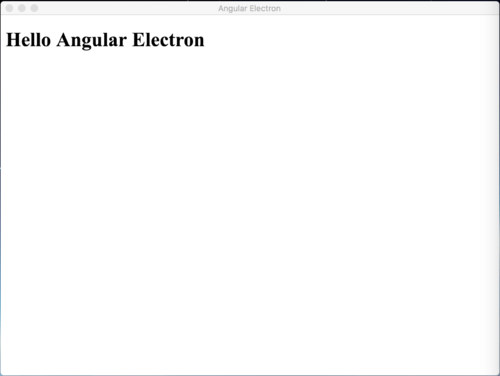

# ng2-electron

Create a desktop app with Angular 2 and Electron. This is a simple example and just for learning.

# initial condition
make sure typescript global installation, please run below first:  
npm install -g typescript

# screen shot

